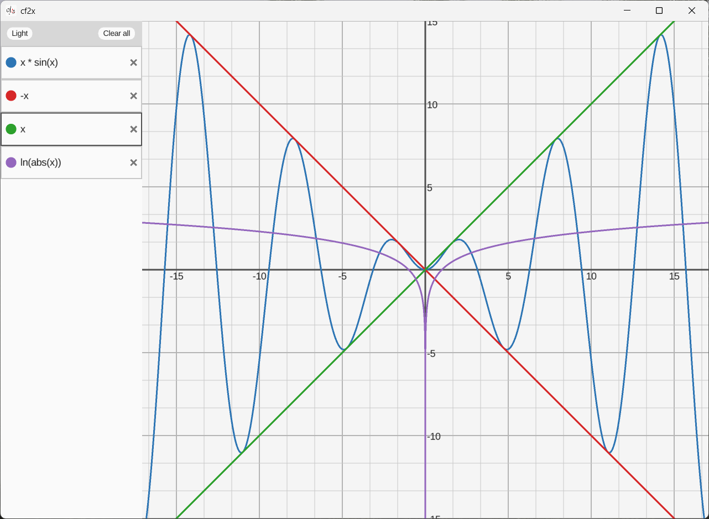
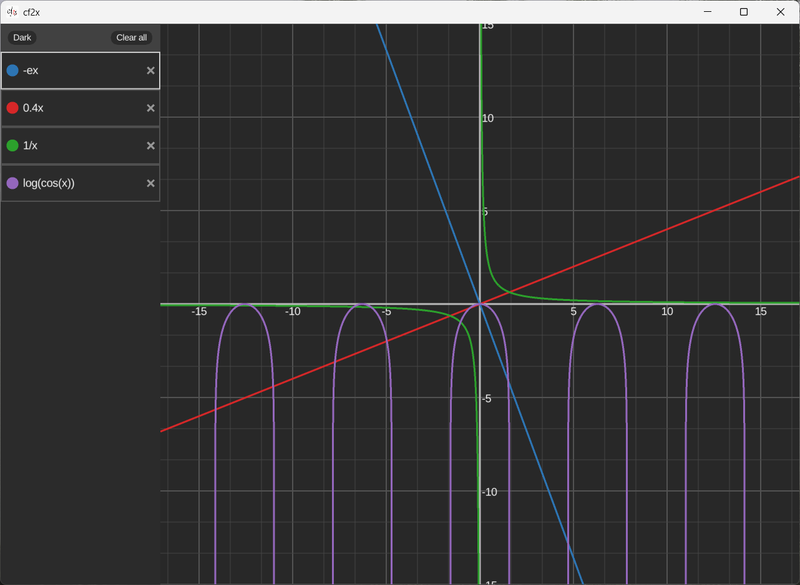

<div align="center">
  
  <p>A simple function plotter written in C and Raylib</p>
</div>

## Features
- Supports single-variable equations with brackets, math operators and some functions
- Is able to parse implicit multiplication and unary negation (shunting yard parser with RPN evaluator)
- Has interactive pan and zoom, dynamic coordinate grid and axis labels
- Uses recursive adaptive sampling to handle curvature plots
- Impelents SSAA for smoother lines and has a dark theme

## Gallery
<table align="center">
  <tr>
    <td></td>
    <td></td>
  </tr>
</table>

## Installation
### Windows
Download the zip archive from [Releases](https://github.com/kester4/cf2x/releases/latest). Extract it, and run `cf2x.exe`. No installation required

### Linux
Download the tarball from [Releases](https://github.com/kester4/cf2x/releases/latest). Extract it, cd and run:
```bash
sudo install -Dm755 cf2x /usr/local/bin/cf2x && \
sudo install -Dm644 assets/cf2x.png /usr/local/share/cf2x/cf2x.png && \
sudo install -Dm644 assets/LiberationSans-Regular.ttf /usr/local/share/cf2x/LiberationSans-Regular.ttf && \
sudo install -Dm644 cf2x.desktop /usr/local/share/applications/cf2x.desktop
```
To uninstall, respectively:
```bash
sudo rm -f /usr/local/bin/cf2x \
  /usr/local/share/cf2x/cf2x.png \
  /usr/local/share/cf2x/LiberationSans-Regular.ttf \
  /usr/local/share/applications/cf2x.desktop && \
sudo rmdir /usr/local/share/cf2x 2>/dev/null || true
```

## Building from source
### Linux
1) Install [Raylib](https://github.com/raysan5/raylib)
2) Clone the repo and cd:
```bash
git clone https://github.com/kester4/cf2x.git && cd cf2x
```
3) Compile:
```bash
make
```
> Or, if you have a high-DPI monitor:
```bash
make HIGHDPI=1
```

### Windows
1) Download [Raylib](https://github.com/raysan5/raylib/releases/latest) and clone the repo
2) Compile with, for example, [clang](https://clang.llvm.org/):
```powershell
clang -o cf2x.exe `
    .\src\*.c `
    -std=c11 `
    -Wall -Wextra -Wpedantic -Wformat `
    -L"C:\raylib-6.0_win64_msvc16\lib" `
    -I"C:\raylib-6.0_win64_msvc16\include" `
    -lraylib -lopengl32 -lgdi32 -lwinmm -luser32 -lshell32
```

## Controls
- `Enter` on equation to add a new one 
- `Ctrl + R` to reset zoom and pan to defaults
- `R` to reset pan
- `Up`, `Down`, `Left`, `Right` for input menu navigation

## Current issues
- Some equations may produce unexpected results

## TODO
- [x] Add horizontal/vertical scrolling to the input menu  
- [x] Make `refine_plot()` detect things like `1/x + C`  
- [x] Implement inserting new equations between already existing ones in the input menu
- [x] Add `log`/`ln` and `exp` letter support  
- [ ] Offload plots rendering to the GPU  
- [x] Add a dark theme
